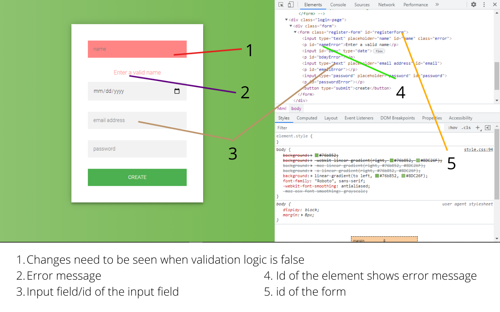

# Formna
### Quickly validate forms on your website

<br>Formna is a fast, small, and easy to use JavaScript library. It makes the input and form validation super easy as validation logic can be changed according to users requirements.

## Install
```npm install formna```
  
## Usage

* To Validate a Single Input

```javascript
  import { validateInput } from "formna";

  const inputId = "name"; // id of the input field
  const errorId = "nameError"; // id of the error field relevant to the input
  const initialValue = ""; // initial value
  const errorMessage = "Enter a valid name"; // error message to be show
  const errorClassName = "error"; // class related to changes to be shown in the input element when an error occurs
  const validator = (inputVal) => inputVal.trim().length > 0; // validation logic

  const {
    value: nameInputValue,
    isValid: isNameValid,
    focus: focusName,
    hasError: nameHasError,
    reset: resetName
  } = validateInput(inputId, errorId, initialValue, errorMessage, errorClassName, validator)
  ```
* To Validate a Complete Form.
```javascript
  import { validateForm } from "formna";

  const className = "form";
  const fileldDetails = [
    {
      id: "username", //id of the input field
      errorId: "usernameError", //id of the error field of the respective input
      initialValue: "", // initial value of the input
      errorMessage: "Enter a valid email", // error message to be shown
      errorClassName: "error", // class related to changes need to be seen in the input element
      validator: (inputVal) => inputVal.includes("@"), // validation logic
    },
    {
      id: "password",
      errorId: "passwordError",
      initialValue: "",
      errorMessage: "Enter a valid password",
      errorClassName: "error",
      validator: (inputVal) => inputVal.toString().trim().length > 6,
    },
  ];
  const postEndPoint = ""; // this is completely optional. you can see the same results without passing the third parameter.
  validateForm(className, fileldDetails, postEndPoint);
  ```
## Conclucsion

Using Formna you can implement real time form validation with side effects in your vanilla.js project.